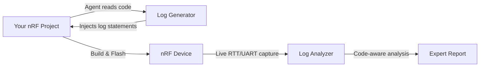

# nRF AI Debugger

### Open-Source AI Agent for Debugging nRF Devices

Captures live logs from your nRF boards, analyzes BLE behavior, and generates detailed reports — right from VS Code.

  
  
  
  

<!-- Replace with actual demo GIF once recorded -->

---

## The Problem

**Debugging BLE applications on nRF devices is painful.** You flash your firmware, open a terminal, and stare at raw logs scrolling past. You try to match timestamps between two connected devices. You manually search your source code to figure out what that error code means.

**nRF AI Debugger changes that.** It's an AI agent that lives inside VS Code — it captures live logs from your connected nRF boards and analyzes them, correlating log output with your actual source code to pinpoint issues. No more guessing.

---

## Features

### 📊 Capture & Analyze Device Logs

Your AI debugging partner captures live logs from connected nRF boards, reads them like an expert, and produces a structured analysis report — including boot verification, connection flow, data transfer metrics, and error diagnosis.

<!-- Replace with actual Feature GIF once recorded -->

**Key Capabilities:**
- 🔍 **Auto-detects** connected devices via J-Link serial numbers
- 📡 **Dual-device capture** — record two devices simultaneously (e.g. Central + Peripheral)
- 🧠 **Code-aware analysis** — correlates log errors with your source code
- 📋 **Expert reports** — structured analysis with connection timeline, performance metrics, and root cause
- 💡 **Proactive suggestions** — recommends deeper logging if data is sparse, offers detailed report generation

---

### 🔧 Generate Logging Code

Before you can analyze, you need good logs. The agent reads your nRF Connect SDK project, understands the BLE stack, and injects the right log statements — so when it analyzes later, it knows exactly what each line means.

<!-- Replace with actual Feature GIF once recorded -->

**Key Capabilities:**
- 📁 **Multi-project awareness** — handles Central + Peripheral workspaces simultaneously
- ⚙️ **Auto-configures** logging backend (RTT vs UART) in `prj.conf`
- 🎯 **NCS-compliant** — follows Zephyr RTOS logging best practices
- 🔘 **Interactive** — asks before modifying, suggests RTT over UART for BLE projects

> **Why does the agent generate the logging code?** Because an agent that wrote the log statements can analyze the output far more intelligently — it understands the context because it created it.

---

## Quick Start

1. **Install** nRF AI Debugger from the [VS Code Marketplace](https://marketplace.visualstudio.com/items?itemName=adsumnetworks.nrf-ai-debugger)
2. **Open** your nRF Connect SDK project in VS Code
3. **Click** the nRF AI Debugger icon in the sidebar
4. **Configure** your AI provider (see [Tested Models](#tested-models) below)
5. **Choose** a mode: **"Analyze Device Logs"** or **"Generate Logging Code"**

---

## Requirements

| Requirement | Details |
|-------------|---------|
| **VS Code** | v1.84 or later |
| **nRF Connect SDK** | v2.x or v3.x |
| **[nRF Connect Extension Pack](https://marketplace.visualstudio.com/items?itemName=nordic-semiconductor.nrf-connect-extension-pack)** | Required — includes terminal, toolchain manager, and device tree support |
| **Python** | 3.8+ (used by log capture scripts) |
| **Hardware** | nRF DK or any J-Link-compatible board for RTT capture |
| **AI Provider** | See [Tested Models](#tested-models) |

---

## Tested Hardware

| Board | BLE | RTT | UART | Status |
|-------|-----|-----|------|--------|
| nRF52840 DK | ✅ | ✅ | ✅ | **Tested** ✅ |
| nRF52832 DK | ✅ | ✅ | ✅ | **Tested** ✅ |

> Built for BLE debugging with the nRF Connect SDK. Should work with other nRF5x boards — [tell us what you're using](https://github.com/adsumnetworks/AIDebug-Agent/issues) and we'll add official support!

---

## Tested Models

nRF AI Debugger works through [OpenRouter](https://openrouter.ai/) and any OpenAI-compatible API endpoint.

| Model | Provider | Tested | Notes |
|-------|----------|--------|-------|
| **GLM-4.7** (Coding Plan) | OpenRouter | ✅ **Recommended** | Best cost/performance ratio for embedded debugging |
| **Claude Haiku 4.5** | OpenRouter | ✅ Tested | Fast, reliable alternative |

> More providers and models coming in future releases. Have a model suggestion? [Let us know!](https://github.com/adsumnetworks/AIDebug-Agent/discussions)

---

## How It Works

- Built on top of [Cline](https://github.com/cline/cline) — an open-source AI coding assistant
- Custom nRF-specific modes with deep knowledge of Zephyr RTOS and the BLE stack
- Embedded Python scripts for reliable J-Link RTT and UART log capture
- Built-in device detection via J-Link and `nrfutil`

---

## Roadmap

| Version | Focus | Status |
|---------|-------|--------|
| **v0.1** | Log Code Generator + Log Analyzer | ✅ Released |
| **v0.2** | Deep BLE stack analysis — connection parameters, PHY negotiation, MTU exchange, GATT operations | 🔜 Next |
| **v0.3** | Expand support — more boards, more tested LLMs, more protocols, more embedded tools (based on community requests) | 📋 Planned |
| **Future** | Driven by **your** needs | [Request a feature →](https://github.com/adsumnetworks/AIDebug-Agent/discussions) |

> We're building this tool based on **real developer needs**. Tell us what board you use, what protocol you debug, and what analysis you need — we'll prioritize accordingly.

---

## About Us

**[Adsum Networks](https://github.com/adsumnetworks)** — We've been developing IoT solutions on nRF and other embedded platforms for over 7 years, building connected systems for smart city and industrial applications using BLE, cellular, and Wi-Fi technologies.

We built nRF AI Debugger because **we needed it ourselves**. Debugging multi-device BLE applications with raw logs was the most painful part of our workflow. So we built an AI agent that does it for us — and now we're sharing it with the community.

This project is part of our broader vision: **creating agentic AI tools for IoT and embedded developers** — not just code generators, but intelligent assistants that understand hardware, protocols, and real-world constraints.

---

## Contributing

Pull requests are welcome! Help us make nRF AI Debugger better:

- 🐛 Report bugs on [Issues](https://github.com/adsumnetworks/AIDebug-Agent/issues)
- 💡 Request features on [Discussions](https://github.com/adsumnetworks/AIDebug-Agent/discussions)
- 🧪 Help us test on more nRF boards
- 🤖 Suggest new LLM models to test

---

## Acknowledgments

- [Cline](https://github.com/cline/cline) — the open-source AI assistant this project builds upon
- [Nordic Semiconductor](https://www.nordicsemi.com/) — for the nRF Connect SDK and exceptional developer tools
- [Zephyr Project](https://www.zephyrproject.org/) — the RTOS powering nRF applications

---

## License

[Apache 2.0 © 2026 Adsum Networks](./LICENSE)
