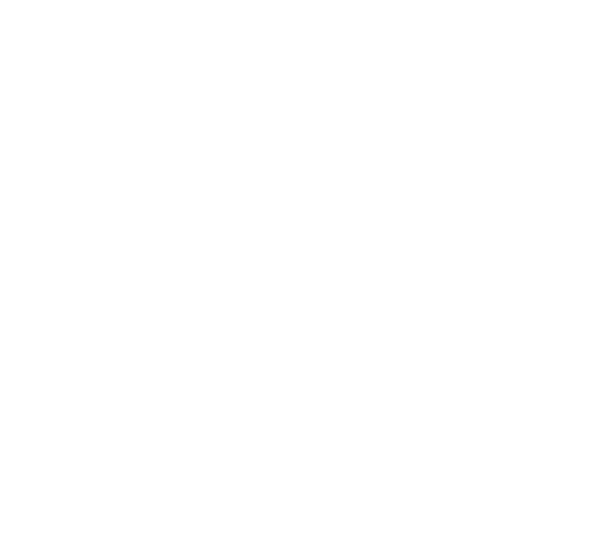
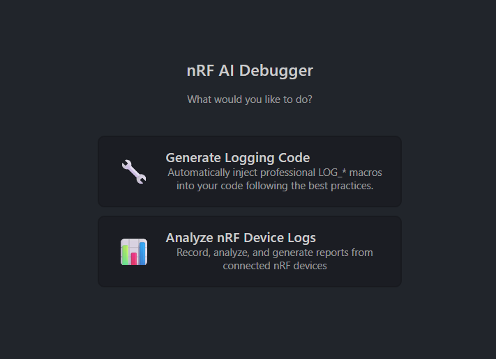
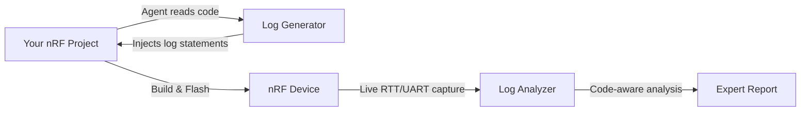

#  SoC AI Debugger
*(formerly nRF AI Debugger)*

### SoC AI Debugger – for nRF

AI debugging agent for IoT SoCs, captures live logs from your connected nRF devices, analyzes application behavior, and generates expert insights — right from VS Code.

  
  
  
  

---

## The Problem

**Debugging firmware on nRF devices is notoriously tedious.** You flash your firmware, open a terminal, and watch raw logs (RTT/UART) scroll past. Trying to correlate timestamps between two boards, decipher hex codes, and manually search your source code to find where an error originated is a major productivity bottleneck.

**SoC AI Debugger** changes that. It's an AI agent built specifically for the nRF Connect SDK ecosystem. It captures live logs directly from your boards and analyzes them in real-time, correlating firmware output with your source code to pinpoint the root cause of failures.

---

## Features

### 📊 1. Capture & Analyze Device Logs
The **SoC AI Debugger** captures live RTT or UART logs, identifies patterns in your application's behavior, and produces structured analysis reports—covering everything from boot sequences to protocol-specific events.

<!-- Replace with actual Feature GIF once recorded -->
<!-- 

 -->

**Key Capabilities:**
- 🔍 **Auto-detects** connected boards via J-Link serial numbers.
- 📡 **Multi-device capture** — two devices (or more) simultaneously (e.g. Central + Peripheral).
- 🧠 **Context-aware analysis** — correlates logs with your actual `main.c` and project files.
- 💡 **Proactive Debugging** — catches Hard Faults or stack overflows and points to the offending line of code.

### 🔧 2. Generate Best-Practice Logging
Before you can analyze, you need good logs. The agent reads your nRF Connect SDK project, understands the BLE stack, and injects the right log statements — so when it analyzes later, it knows exactly what each line means.

<!-- Replace with actual Feature GIF once recorded -->
<!-- 

 -->

**Key Capabilities:**
- 📁 **Multi-project awareness** — handles Central + Peripheral workspaces simultaneously
- ⚙️ **Auto-configures** logging backend (RTT vs UART) in `prj.conf`
- 🎯 **NCS-compliant** — follows Zephyr RTOS logging best practices
- 🔘 **Interactive** — asks before modifying, suggests RTT over UART for BLE projects

> **Why does the agent generate the logging code?** Because an agent that wrote the log statements can analyze the output far more intelligently — it understands the context because it created it.

---

## Quick Start
1. **Install** SoC AI Debugger from the [VS Code Marketplace](https://marketplace.visualstudio.com/items?itemName=AdsumNetwork.nrf-ai-debugger).
2. **Configure** your AI provider (We recommend **GLM-4.7** for cost-effective, high-performance analysis).
3. **Choose** a mode: **"Analyze nRF Device Logs"** or **"Generate Logging Code"**.

---

## Requirements

| Requirement | Details |
|-------------|---------|
| **nRF Connect SDK** | Tested with **v3.2.1** |
| **Extension Pack** | Requires [nRF Connect Extension Pack](https://marketplace.visualstudio.com/items?itemName=nordic-semiconductor.nrf-connect-extension-pack) |
| **Python** | 3.8+ (Uses the Python environment bundled with your nRF Connect Extension) |
| **AI Provider** | Supports OpenRouter or any OpenAI-compatible endpoint. |

---

## Roadmap & Compatibility
We are expanding based on community needs. If you need support for a specific protocol or board, [join our discussions!](https://github.com/adsumnetworks/SoC-AI-Debugger/discussions)

| Category | Supported / Tested | Future Exploration (User Driven) |
| :--- | :--- | :--- |
| **Boards** | nRF52840 DK, nRF52832 DK | nRF53, nRF91, nRF70, nRF54 |
| **Protocols** | BLE (Bluetooth Low Energy) | WIFI, Thread, Matter, LTE-M / NB-IoT, DECT NR+ |
| **NCS Version** | v3.2.x | v2.9.x LTS, v3.3+ |
| **LLMs** | GLM-4.7, Claude Haiku 4.5 | DeepSeek-V3, Local LLMs (Ollama) |

---

## Tested Models

| Model | Provider / Endpoint | Status | Notes |
|-------|----------|--------|-------|
| **GLM-4.7** | OpenAI-Compatible (Coding Plan) | ✅ **Recommended** | Best balance of high coding benchmarks and extreme cost-effectiveness. |
| **Claude Haiku 4.5** | OpenRouter | ✅ Tested | The fastest and most affordable entry-point for professional-grade coding models. |

"We optimized for these models so you can debug for hours for the price of a cup of coffee."

> New to GLM? Follow the [Step-by-Step](https://docs.z.ai/devpack/tool/cline#2-enter-configuration-information) Configuration Guide to get your API key and set up the OpenAI-compatible endpoint in VS Code.

---

## 🔒 Privacy & Security
**Your firmware stays yours.**
 - **Local Control:** The agent runs entirely on your machine. It only sends specific log snippets and code context to your chosen AI provider.
- **BYOK (Bring Your Own Key):** You have full control over which model you use and which API endpoint you trust.
- **Open Source:** Our capture scripts and agent logic are fully transparent and auditable by the community.

---

## 📈 Data & Telemetry
nRF AI Debugger collects **basic, anonymous usage data** to help us understand which features are most valuable and catch silent errors (like missing python packages or unsupported OS commands) before you even have to report them on GitHub.

**What we track:**
- Extension activations (to understand daily usage).
- Which logger tools you trigger (e.g. `uart-logger` vs `rtt-logger`).
- Tool execution crashes or errors.

**What we DO NOT track:**
- We NEVER collect your source code, your absolute file paths, or anything typed into the interactive AI chat.
- We NEVER collect the raw logs coming off your firmware devices. This data is strictly private and sent only to your configured AI provider.

> **Opt-Out:** We respect VS Code's global telemetry settings. If you wish to disable this tracking, simply set `telemetry.telemetryLevel` to `off` in your VS Code settings.

---

## How It Works

---

## About Us
**[Adsum Networks](https://github.com/adsumnetworks)** — We've been developing IoT solutions on nRF and other embedded platforms for over 7 years. We built nRF AI Debugger because we needed it ourselves to handle complex BLE debugging, and now we're sharing it to help the community build better firmware, faster.

---

### ⚖️ Trademark & Disclaimer
This project is an independent, community-developed tool and is not affiliated with, endorsed by, or sponsored by **Nordic Semiconductor ASA**. 

"nRF" is a registered trademark of Nordic Semiconductor ASA. All other trademarks are the property of their respective owners.

---

## Acknowledgments
- [Cline](https://github.com/cline/cline) — The open-source AI assistant this project builds upon.
- [Nordic Semiconductor](https://www.nordicsemi.com/) — For the exceptional nRF Connect SDK and developer tools.

---

## License
[Apache 2.0 © 2026 Adsum Networks](./LICENSE)