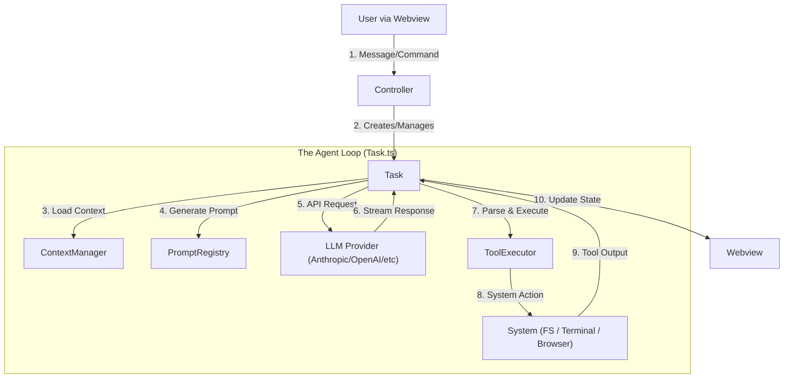
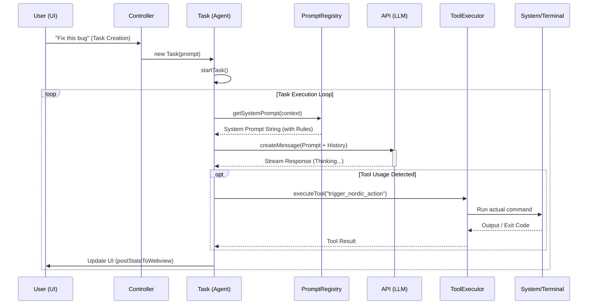

# Internal Architecture & Workflow Deep Dive

This document provides a technical deep dive into the internal workings of the Cline extension, tracing the lifecycle of a user task from the Initial Prompt to Tool Execution.

## High-Level Architecture

The extension follows a **Controller-Agent** pattern where a central `Controller` manages the lifecycle of a `Task` (the agent), which operates in a recursive loop of **Context Loading -> API Request -> Tool Execution -> State Update**.

## Detailed Data Flow Trace

### 1. Initialization & Entry Point
*   **File:** `src/extension.ts`
*   **Mechanism:**
    *   VS Code activates the extension via `activate()`.
    *   `initialize(context)` creates the `VscodeWebviewProvider`.
    *   `VscodeWebviewProvider` instantiates the `Controller`.
    *   **Snippet:** `src/core/webview/WebviewProvider.ts`: `this.controller = new Controller(context)`

### 2. User Input & Task Creation
*   **File:** `src/core/controller/index.ts`
*   **Mechanism:**
    *   User types a message in the Webview.
    *   Message is passed to `Controller.handleTaskCreation(prompt)`.
    *   `Controller` calls `initTask()`, which initializes a new `Task` instance.
    *   **Snippet:** `src/core/controller/index.ts`: `this.task = new Task({ ... })`

### 3. The Main Execution Loop
*   **File:** `src/core/task/index.ts`
*   **Mechanism:**
    *   `Task.startTask()` triggers `this.initiateTaskLoop(userContent)`.
    *   **The Loop:** `initiateTaskLoop` runs a `while (!this.taskState.abort)` loop.
    *   Inside the loop, it calls `this.recursivelyMakeClineRequests(nextUserContent)`.

### 4. Prompt Construction (The "Brain")
*   **File:** `src/core/prompts/system-prompt/index.ts` & `registry/PromptBuilder.ts`
*   **Mechanism:**
    *   Before calling the API, `recursivelyMakeClineRequests` builds the system prompt.
    *   It calls `getSystemPrompt()`, which uses `PromptRegistry` to find the correct `PromptVariant` (e.g., `default`, `architect`, `ask` based on model capability).
    *   `PromptBuilder` resolves placeholders (e.g., `{{cwd}}`, `{{capabilities}}`) and executes component functions (like injecting `rules` and `capabilities`).
    *   **Key Insight:** This is where `src/core/prompts/system-prompt/components/rules.ts` (where we added Nordic rules) is injected.

### 5. API Request & Streaming
*   **File:** `src/core/task/index.ts` (`attemptApiRequest`)
*   **Mechanism:**
    *   `attemptApiRequest` calls `this.api.createMessage(systemPrompt, messages, tools)`.
    *   The response is streamed back via an Async Iterator.
    *   Usage of `p-wait-for` ensures we wait for the first chunk to validate the connection.

### 6. Processing the Response
*   **File:** `src/core/task/index.ts` (`presentAssistantMessage`)
*   **Mechanism:**
    *   As chunks arrive, they are parsed into `text` (thought process) or `tool_use` blocks.
    *   `presentAssistantMessage` handles the logic of showing text to the user immediately while accumulating tool usage data.
    *   **Recursion:** It calls itself recursively to handle multiple content blocks in a single response.

### 7. Tool Execution (The "Hands")
*   **File:** `src/core/task/ToolExecutor.ts` (Called from `Task.ts`)
*   **Mechanism:**
    *   When a `tool_use` block is complete, `Task` calls `this.toolExecutor.executeTool(block)`.
    *   `ToolExecutor` switches on the tool name (e.g., `execute_command`, `read_file`, `trigger_nordic_action`).
    *   **Crucial for Nordic:** This is where `trigger_nordic_action` is dispatched. It validates arguments and runs the underlying logic.
    *   The tool returns a result, which is fed back into the `Task` loop as `userContent` (simulating user feedback), prompting the next iteration of the LLM.

### 8. State Updates & UI
*   **File:** `src/core/controller/index.ts` (`postStateToWebview`)
*   **Mechanism:**
    *   Throughout the process, `this.postStateToWebview()` is called to sync the React state in the Webview with the backend state.
    *   This ensures the user sees the "Thinking...", tool outputs, and terminal logs in real-time.

## Sequence Diagram

## Key Components Summary

| Component | Responsibility | Key Files |
| :--- | :--- | :--- |
| **Controller** | Orchestrates global state, task lifecycles, and auth. | `src/core/controller/index.ts` |
| **Task** | The active agent instance. Manages the execution loop and state. | `src/core/task/index.ts` |
| **PromptBuilder** | Assembles the "Brain" (System Prompt) dynamically. | `src/core/prompts/system-prompt/registry/PromptBuilder.ts` |
| **ToolExecutor** | The "Hands". Executes requested tools safely. | `src/core/task/ToolExecutor.ts` |
| **WebviewProvider** | Manages the frontend-backend bridge. | `src/core/webview/WebviewProvider.ts` |
